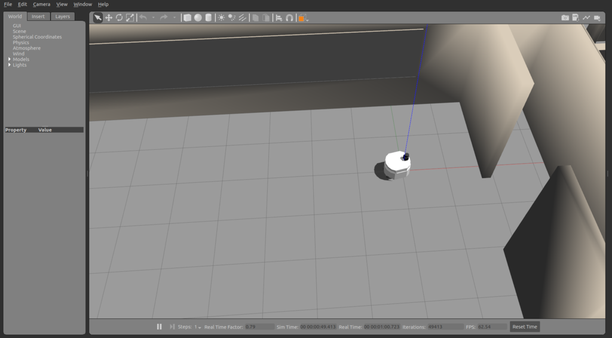

# simulate a world with closed walls

In order to simulate an indoor world, source your ROS environment and catkin workspace, and then launch gazebo.launch with the willowgarage world.

```console
foo@bar:~$ source /opt/ros/melodic/setup.bash
foo@bar:~$ source /path/to/catkin_ws/devel/setup.bash
foo@bar:~$ roslaunch patrolbot_gazebo gazebo.launch world:=worlds/willowgarage.world
```

