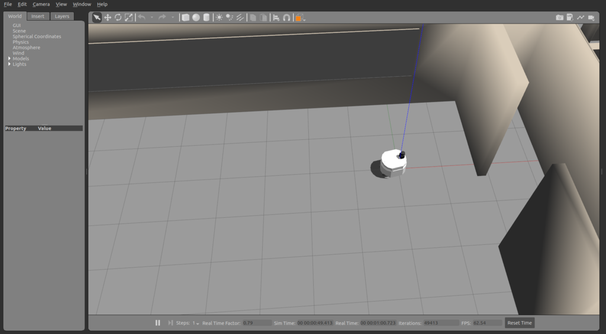
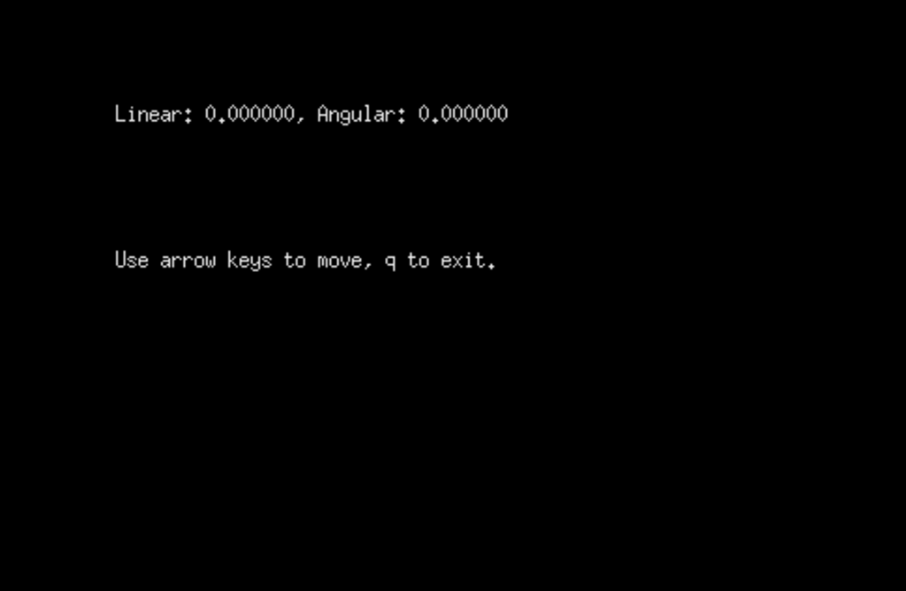

# keyboard teleoperation with gazebo

First, source your environment and launch gazebo.launch, found inside the package patrolbot_gazebo.

```console
foo@bar:~$ source /opt/ros/melodic/setup.bash
foo@bar:~$ source /path/to/catkin_ws/devel/setup.bash
foo@bar:~$ roslaunch patrolbot_gazebo gazebo.launch world:=worlds/willowgarage.world
```



Then, open another terminal and launch teleop.launch, found inside the package patrolbot_teleop. After executing these commands, another window should be opened automatically, where you can send keyboard commands to control the robot's twist.

```console
foo@bar:~$ source /opt/ros/melodic/setup.bash
foo@bar:~$ source /path/to/catkin_ws/devel/setup.bash
foo@bar:~$ roslaunch patrolbot_teleop teleop.launch
```

